```{r,message=FALSE,warning=FALSE,tidy=TRUE,echo=FALSE}
setwd('~/Sync/projects/work_projects/class_work/collecting_storing_data/term_project/')
library(knitr)
library(png)
library(jpeg)
library(dplyr)
library(ggplot2)
library(mongolite)
```

# Introduction

There is growing scientific and practical interest in using large sets of human eye movement behavior data for biometric purposes [@itti_new_2015]. Eye movement data meets a number of the criteria for "big" data analytics and storage. First, they have significant "volume" in that raw eye movement data records typically contains thousands of records describing horizontal and vertical coordinates of gaze (fovea placement in screen coordinates). Second, they have significant "variety" in terms of experimental meta-data and stimuli. The latter ranges from procedurally generated images of simple geometric shapes to minutes or hours long video sequences displayed at 4k. 

Third, they have unique challenges in terms of  data "veracity" and "validity". Eye movement data is inherently noisy and non-stationary, frequently contains missing or impossible values that require special error-handling. Raw gaze data is not typically useful on its own, but requires processing into a set of "macro" eye movement type events, such as saccades (large ballistic movements that reposition the center of vision over new inspection targets) and fixations (periods of relative oculomotor stability). This process depends on algorithms with many user selected parameter values.  This means that it has at least four of the six "V" descriptors used to define data as "big" [@jain_data_2015]. Despite this, it is still most commonly stored and distributed in text or binary data files (though see @wilming_extensive_2017 for an excellent recent effort away from this).

# Project goals and justification

For my term project, I've collected several eye movement data sets that I will ultimately use to test eye biometric classifiers for _user task_ in my dissertation. My goal for the project is to integrate them, link them tightly to their associated stimuli, and to evaluate the merits of a storing and retrieving them from a true database instead of from the raw data sources.

There are two particular challenges to working with them that have informed my decision about choice of database. The first is their  hierarchical structure: individual data points are nested within trials, within subjects, and these finally within an experiment. This means the data is poorly structured for traditional relational databases, as getting it to third normal form would require the use of many adjacency lists, nested set representations, or a cumbersome number of "intermediary" data tables to appropriately express the numerous "many to many" relationships formed within the data, See [this](https://wiki.postgresql.org/images/a/ad/Hierarchial.pdf) and [this](https://www.mattduvall.com/storing-hierarchical-data-I) site for some discussion of the issues involved.

The second is the experimental stimuli, and the importance of maintaining strong relationships between gaze and stimulus data. Eye movement positions are not typically used as features in related biometric classifiers by themselves. Rather, they used as indexes from an image aligned map or model of scene content believed to drive different pathways of eye movement control activity in the brain. To be useful, the database should therefore permit fast, accurate sampling directly from these maps. Though this constraint can be addressed through supplementary text-files/meta-data that provide file paths to the appropriate stimuli, this approach is fragile and cumbersome at scale. SQL does have a "blob" data type that makes it possible to store (small) images in a table, and many NoSQL database systems allow very significant data type flexibility, but the consensus appears to be that images should not be stored in databases but in the host file-system or a specialized file-system/container within it (see [this site](https://www.quora.com/Is-it-a-bad-design-to-store-images-as-blobs-in-a-database) for some discussion of this point also). 

It is therefore clear that a NoSQL DBMS is the correct choice for this project. The freedom from normalization constraints relaxes the difficulty of building a schema that accommodates the nested structure of the data. Though I will not be storing the stimuli as would be ideal, but only the paths to them alongside the data for the project, it is likely to be significantly easier to do so if I eventually wanted to test this. Finally, I will likely expand the database to include other data sets in the future. As there's no risk of an insufficient relational schema breaking relationships or causing anomalies at update, a NoSQL DBMS will make updating it in this way much safer. The project will therefore aggregate: 

1. eye movement data -- only fixation records at this time
2. experimental meta-data (equipment parameters, sampling times, etc)
3. paths to experimental stimuli, if they are available
4. subject demographic data, if it is available

into a single MongoDB document.

# Format of Each Subset of the Raw Data

We're working with four different kinds of data that need to get merged for this project. Each type can be thought of as a table, though not one that necessarily corresponds to the forms specified by relational DBs.

## Fixation data

Fixation data are points that describe where a particular subject was looking in a particular image during a specific trial at a particular time, as well as for how long. The fixation data table has eight variables: horizontal position ("x_position"), vertical position ("y_position"), fixation duration ("duration"), the experimental subject from whose data it was taken ("subject"), the number of the fixation within a particular subject/trial record ("fixation"), the image the subject was inspecting during the trial from which the data was taken ("image"), the task type a subject was performing for a particular trial ("task_type"), and the experiment the data is associated with ("experiment") (Figure \@ref(fig:fixationExample)).

```{r fixationExample,message=FALSE,warning=FALSE,echo=FALSE,tidy=TRUE,fig.retina=NULL,out.width="0.5\\textwidth",fig.align="center",fig.cap="Example of fixation data"}
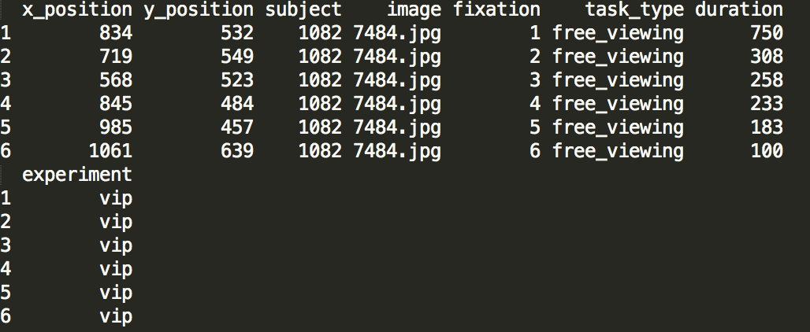
```

## Experimental meta-data

Experimental meta-data describes things like the hardware/displays used, stimulus display times, etc. The meta-data for the experiments has nine variables: the name of the experiment ("experiment"), a link to the source of the data ("source"), the width of the monitor used in the experiment ("monitor_width_pix"),the height of the monitor used in the experiment ("monitor_height_pix"), the distance between the subject and the monitor ("viewing_distance"), the eye tracking hardware used ("eye_tracker_used"), the sampling rate for the data ("eye_tracking_sampling_rate"), the length of the trial ("trial_duration"), and the tasks in the experiment ("tasks") (Figure \@ref(fig:experimentExample)).

```{r experimentExample,message=FALSE,warning=FALSE,echo=FALSE,tidy=TRUE,fig.retina=NULL,out.width="0.5\\textwidth",fig.align="center",fig.cap="Example of fixation data"}
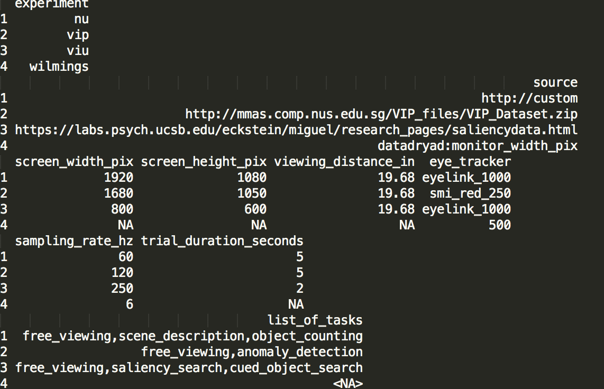
```

## Stimuli data

Stimuli information for these sets are essentially path information/labels used to align subject/trial data records with this data where necessary, and to make it easy to access the images in the file-system/consistently name new images generated by doing some image processing on them. There are four variables in the data frame as a result: the name of the image file, including the file extension ("image"), the name of the image without the file extension ("image_labels"), the full file path to the image on my system ("full_image_path"), and the experiment the image was inspected in ("experiment") (Figure \@ref(fig:exampleStimuli)).

```{r exampleStimuli,message=FALSE,warning=FALSE,echo=FALSE,tidy=TRUE,fig.retina=NULL,out.width="0.5\\textwidth",fig.align="center",fig.cap="Example of fixation data"}
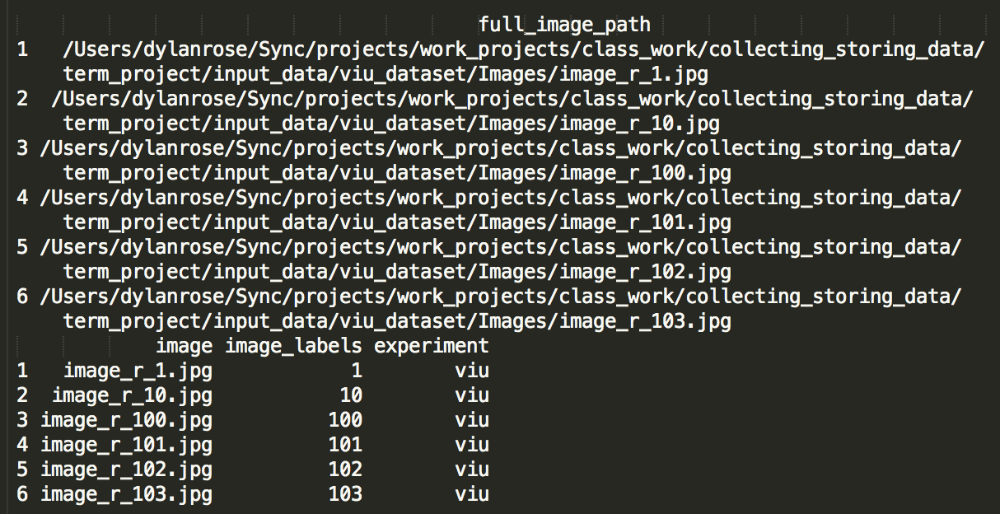
```

## Subject demographic data

Subject meta data describes subject parameters, such as their age, gender, etc. The demographic data table contains the following following five variables for each subject: some subject-specific id-code ("subject"), their gender if it was available ("gender"), their age if it was available ("age"), their neuro-psychological status ("neuropsych_status"), and the experiment they were in ("experiment") (Figure \@ref(fig:exampleDemographic)).

```{r exampleDemographic,message=FALSE,warning=FALSE,echo=FALSE,tidy=TRUE,fig.retina=NULL,out.width="0.5\\textwidth",fig.align="center",fig.cap="Example of fixation data"}
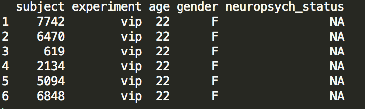
```

# Raw Data Collection

Collecting the raw data for this project was straightforward. The raw data are four sets of eye movement data, three of which are taken from public sources, and one from an experiment I ran here. Eye movements made by observers in each experiment were made in response to a minimum of two tasks while inspecting unedited images of natural scenes. The sets are as follows:

1. The VIP dataset taken from the [MIT Computational Saliency Model Benchmark site](http://saliency.mit.edu/datasets.html). seventy-five subjects inspected a set of 150 neutral and emotional affecting images while performing either a free viewing or an anomaly detection task. Each subject was shown each image for five seconds.

2. The VIU dataset taken from the same database as the VIP set. Eighty subjects performed one of three separate tasks: free viewing (twenty-two subjects), saliency search (twenty subjects), and cued object search (thirty-eight). Subjects were given two seconds to inspect each image.

3. The Wilmings-Onat "head-fixed" dataset was taken from a [dedicated data repository](https://datadryad.org//resource/doi:10.5061/dryad.9pf75) containing a number of eye movement datasets. For this experiment, nineteen observers performed one of two tasks while viewing images of "urban scenes": free viewing and guided viewing. Subjects were given six seconds to inspect each image.

4. A custom data set of eye movement data I collected from fifteen Northeastern University undergraduate students (referred to hereafter as "NU" dataset). Subjects completed 210 trials, each of which required them to perform one of three tasks: free viewing, scene viewing in preparation for scene description, and object counting. Each subject completed seventy trials for each task on a randomly ordered list of 210 images of natural scenes.

For the first three, some effort had been made to clean and package the data in a systematic way. Both the VIP and VIU sets were available from the same website and provided access to meta-data in a straightforward tabular format (Figure \@ref(fig:vipDownload)).

```{r vipDownload,message=FALSE,warning=FALSE,echo=FALSE,tidy=TRUE,fig.retina=NULL,out.width="0.75\\textwidth",fig.align="center",fig.cap="Download link for the VIU and VIP datasets."}
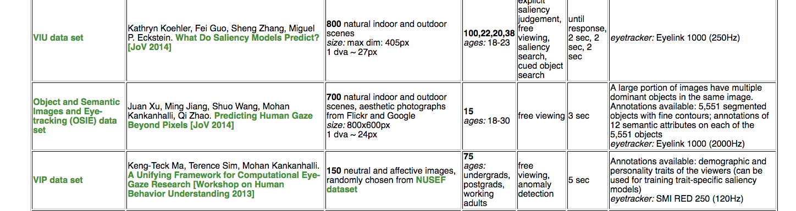
```

The data for the Wilmings set was also straightforward to obtain. I downloaded the provided hdf5 file of gaze data, as well as the folder of images and the meta-data about subjects for the experiment directly from [DataDryad.org](https://datadryad.org/) (see Figure \@ref(fig:dataDryadDownload)). I then wrote a simple piece of processing code in python that accessed the data from the hdf5 file (see Figure \@ref(fig:wilmingPyScript)). 

```{r dataDryadDownload,message=FALSE,warning=FALSE,echo=FALSE,tidy=TRUE,fig.retina=NULL,out.width="0.5\\textwidth",fig.align="center",fig.cap="Download link for Wilmings dataset"}
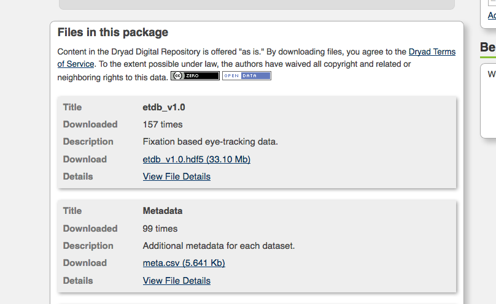
```

```{r wilmingPyScript,message=FALSE,warning=FALSE,echo=FALSE,tidy=TRUE,fig.retina=NULL,out.width="0.5\\textwidth",fig.align="center",fig.cap="Python script for getting data out of the Wilmings hdf5 file"}
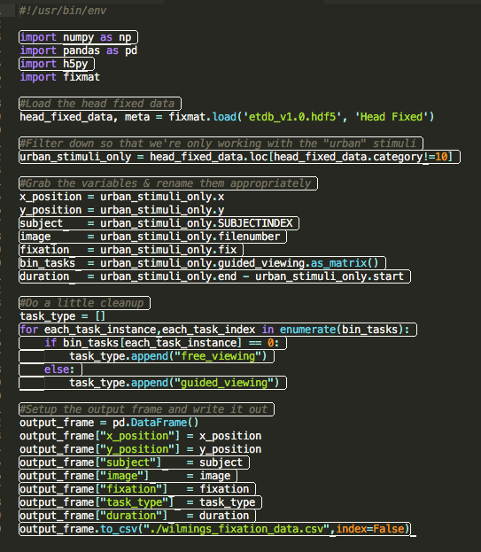
```

The data from the NU dataset had already been pre-processed into subject/trial specific text files containing fixation data, so I didn't need to do anything there, either.


# Pre-processing the Raw Data

This was by far the most labor intensive part of the project. While accessing the data from its original set of sources was easy, the differences in file naming and storage formats made getting all of the data into _R_ in a consistent way quite challenging. I'll talk about the difficulties associated with each experiment separately, but the code required to do so generally followed a consistent set of steps at a certain level of abstraction:

1. Read the data in from (typically) plain text or structured text files, making any experiment-specific tweaks necessary based on the differences in the data structure.
2. Apply some experiment-specific data cleaning function to its content (set variable types, drop data for certain subjects/image types, etc.)
3. Bind the cleaned data together into a single data frame.

## Experimental meta-data

The first thing I had to do was create some kind of unified representation of the meta-data associated with each experiment. This includes information about things like the size of the display the images were shown on, the length of the recording period within a trial, and so on. To do this, I made a simple template .txt file (Figure \@ref(fig:templateText))

```{r templateText,message=FALSE,warning=FALSE,echo=FALSE,tidy=TRUE,fig.retina=NULL,out.width="0.5\\textwidth",fig.align="center",fig.cap="Experiment meta data text file template."}
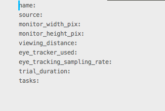
```
These files can then be simply read together and aggregated to provide a table of this information for all of the experiments we have data for. 

## VIP set

The VIP experiment dataset was probably the most frustrating and difficult one to work with. Each subject's data came in an "events.txt" file generated by the eye-tracking system experiment manager. Though they're plain text, they're not well-structured (see Figure \@ref(fig:exampleVIPFile)). For example, they have twenty lines of header material, the data for different images/trials is mixed within them in chunks separated by comments containing the name of the image, and different types of data (saccades,fixations,blinks,errors) are all mixed up together in-line.

```{r exampleVIPFile,message=FALSE,warning=FALSE,echo=FALSE,tidy=TRUE,fig.retina=NULL,out.width="0.5\\textwidth",fig.align="center",fig.cap="Example VIP data file"}
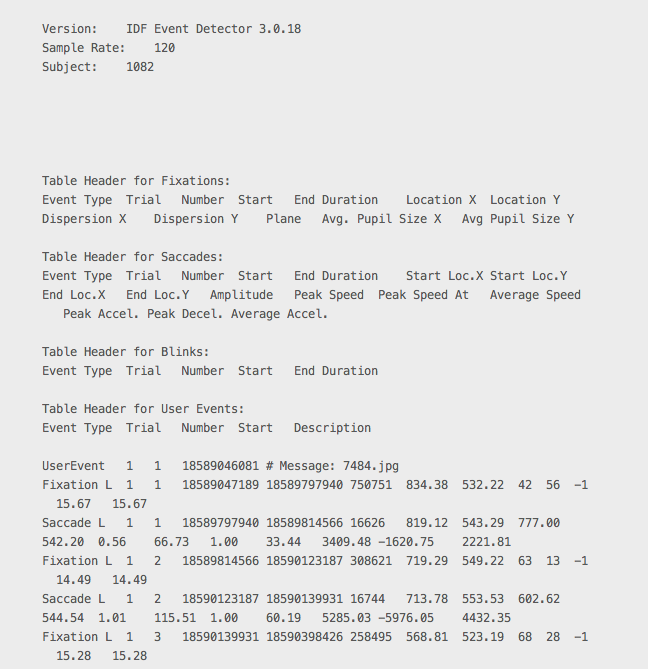
```

This meant that the "read" function for the VIP is the single longest piece of code for the entire project (roughly 40 lines, see Figure \@ref(fig:vipReadData)), as it requires dealing with a number of special cases/has to select specific types of data out of the mix.

```{r vipReadData,message=FALSE,warning=FALSE,tidy=TRUE,echo=FALSE,fig.retina=NULL,out.width="0.65\\textwidth",fig.align="center",fig.cap="VIP data read function"}
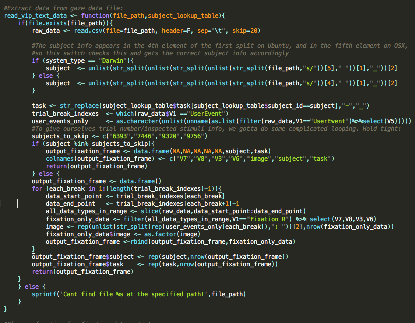
```

Though the experimenters provide some of the image data, a great deal of it is actually taken from an image dataset that is not publicly available. The image data/paths have therefore been just treated as missing for the purposes of this project. Subject demographic data was provided in a csv file which was easy to load and align with the data on the basis of matching subject id strings between the two data frames.


## VIU set

The VIU experiment set was much less complicated. Fixation data for each subject/trial was stored in well-structured plain-text files, separated by task (e.g. Figure \@ref(fig:viuFreeviewingExample))

```{r viuFreeviewingExample,message=FALSE,warning=FALSE,tidy=TRUE,echo=FALSE,fig.retina=NULL,out.width="0.5\\textwidth",fig.align="center",fig.cap="VIU free-viewing task fixation raw data example"}
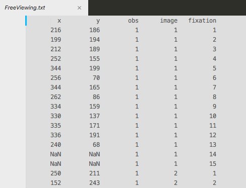
```

I therefore simply had to load the file for each task and paste them together to get the fixation data frame setup. 

The image data was available for this experiment, and to read it in/process it I simply looped over each location in the image sub-directory for that dataset to get the image path/image names. The image label variable information just took a bit of string processing to separate the file from the file extension. No subject demographic data was provided for this experiment, so it was all treated as a set of NAs. 

## Wilmings set

To get the fixation data for this experiment, I simply ran the extraction python code I presented in Figure \@ref(fig:wilmingPyScript). This dumped the fixation data into a simple csv file with the appropriate column names for all of the subjects who completed the experiment. The stimuli were available for this experiment, and I followed the same procedure for getting the stimuli paths/labels/names that I used for the VIU experiment. Finally, the subject meta-data was provided by the original posters of the data in a simple csv file, so it was easy to read.

## NU set

This data set was the one from my experiment. The raw fixation data was available in a set of csv files, and could be read simply by looping through the directory where the data was stored and reading in each file's data. The stimuli are available for this experiment, but for reasons beyond the scope of this project report I could not include their information here. They were therefore treated as missing. Subject demographic meta-data was available in a basic csv file, and it too could be read into _R_ straightforwardly. 

# Storage

Once all of the data had been collected for each of the four experiments, getting it ready for storage was easy. The fixation, image, and demographic data types within a particular experiment were bound together using a set of nested merges: first between the fixation data and the subject demographic data on the variables "subject" and "experiment", then between the resulting table and the image meta-data table on the "image" and "experiment" variables. Each of these subject-specific merged data frames was then bound together into a final data frame by row-wise binding (Figure \@ref(fig:mergeDataByExp))

```{r mergeDataByExp,message=FALSE,warning=FALSE,tidy=TRUE,echo=FALSE,fig.retina=NULL,out.width="0.65\\textwidth",fig.align="center",fig.cap="Data merge process for each experiment prior to row-wise binding across experiments."}
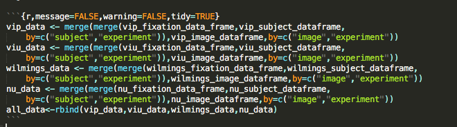
```

We then create a connection to a MongoDB document called "fixation_data" and insert the "all_data" frame, as well as the frame of experimental meta-data into that same document (Figure \@ref(fig:finalInsert))

```{r finalInsert,message=FALSE,warning=FALSE,tidy=TRUE,echo=FALSE,fig.retina=NULL,out.width="0.5\\textwidth",fig.align="center",fig.cap="Data merge process for each experiment prior to row-wise binding across experiments."}
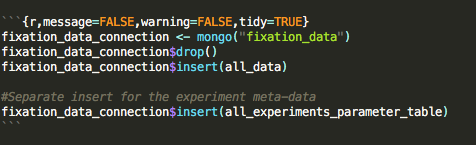
```

# Testing
```{r,message=FALSE,warning=FALSE,tidy=TRUE,echo=FALSE}
fixation_data_connection <- mongo("fixation_data")
```

Just to test out what this lets us do, we can produce nice plots of things like the gender of subjects across experiments:

```{r,message=FALSE,warning=FALSE,tidy=TRUE,echo=FALSE,out.width="0.5\\textwidth"}
gender_data<-fixation_data_connection$aggregate('[{"$group":{"_id":"$gender","count":{"$sum":1}}}]')
colnames(gender_data) <- c("gender","count_of_gender")
ggplot(gender_data,aes(x=gender,y=count_of_gender,fill=gender))+geom_bar(stat="identity")+theme_classic()+xlab("gender")+ylab("count")+ggtitle("Count of subject genders across experiments")
```

or the total number of fixation records in each of the experiments:

```{r,message=FALSE,warning=FALSE,tidy=TRUE,echo=FALSE,out.width="0.5\\textwidth"}
point_count_data<- fixation_data_connection$aggregate('[{"$group":{"_id":"$experiment","count":{"$sum":1}}}]')
colnames(point_count_data)<- c("experiment","number_of_fixations")
ggplot(point_count_data,aes(x=experiment,y=number_of_fixations,fill=experiment))+geom_bar(stat="identity")+theme_classic()+xlab("experiment")+ylab("count")+ggtitle("Count of fixation points for each experiment")
```

or even cool stuff like plotting a smooth 2d distribution for all the points available for a particular image and task:

```{r,message=FALSE,warning=FALSE,tidy=TRUE,echo=FALSE,out.width="0.5\\textwidth"}
image_paths  <- fixation_data_connection$distinct("full_image_path")
random_image <- image_paths[sample(1:length(image_paths),1)]
data_for_image <- fixation_data_connection$find(sprintf('{"full_image_path":"%s"}',random_image))
available_tasks <- unique(data_for_image$task_type)
selected_task <- available_tasks[sample(1:length(available_tasks),1)]
data_for_image_and_task <- filter(data_for_image,task_type==selected_task,!is.na(x_position),!is.na(y_position))
ggplot(data_for_image_and_task,aes(x=x_position,y=y_position))+geom_density_2d()+theme_classic()+xlim(0,500)+ylim(0,500)+ggtitle(sprintf("2d probability distribution for all %d points available for \nimage %s and task %s",nrow(data_for_image_and_task),data_for_image_and_task$image[1],selected_task))+xlab("horizontal pixel coordinates")+ylab("vertical pixel coordinates")
```


# Discussion, limitations, next steps

## Discussion

I believe I've accomplished my stated objectives for my project, and am extremely pleased with the results. Although a significant amount of work was required to move from raw data to the database, the advantages of using a database rather than the raw data as it was available by default are _immediately_ apparent. While the need to aggregate many kinds of information cleanly across experiments like this is less common in experimental contexts, for my purposes it enables forms of information manipulation and aggregation that would be prohibitively time and effort consuming. Being able to compare, e.g. spatial distributions of gaze points across observers and images for the _same task type across experiments_, is a completely novel and exciting experience. 

While I've had to lean on records documenting the location of specific stimuli in my host file system instead of including image files in the database itself, the form of the resulting database would make it extremely easy to pull the image files in directly using scripting in other languages. 

Finally, although the pre-processing pipeline and the initial data insertion operation into the Mongo document is slow, querying the database--even for data sets that are going to be large--is incredibly fast. The time elapsed on the execution of even fairly complex queries is nowhere near that required to execute the initial preprocessing pipeline for a particular experiment, which is the closest appropriately time-performance comparison. 

## Limitations

The most significant limitation to using _MongoDB_ in this context, and particularly with _mongolite_ in _R_, is the paste/sprintf manipulations required to create procedurally driven queries. Though this can be addressed by using filtering with something like _dplyr_ following a broader query, _mongolite_'s functionality feels incomplete in this way. 

The data aggregation pipeline as I've created it is pretty robust, but it is also slow: it takes several minutes to build the database from start to finish. Replacing loops within functions, as well as using parallelized versions of the same code, should help address this down the line.

## Next steps

For my next steps, I'd like to begin exploring the use of MongoDB database creation/querying outside of _R_. For example, though it is possible to overcome the schematic complexity of hierarchical data such as this by dumping it all into a single _MongoDB_ document, _MongoDB_ itself naturally supports hierarchical structuring of data properties -- _mongolite_ commands don't seem to accommodate this function straightforwardly. 

I'd also like to build out more robust exception handling/sets of modification to a core set of code that would permit R to flexibly extract all four types of data from a source folder with a consistent structure. To do this correctly requires true object oriented code to create classes and experiment specific methods, and _R_'s functionality for doing so wasn't a part of the course instruction is beyond my experience with _R_ outside the context of the course. 

Though it might require the use of a different language, I would like to build-in code to move stimuli into a consistent set of positions in a specialized file-system object, such as an hdf5 file. This would make it possible to build two separate but extremely tightly linked objects containing the gaze data and related stimuli via path specifications in the former to elements in the file-system object. 

Finally, I'd like to explore the use of the MapReduce functionality _MongoDB_ provides to enable in-database processing and data alignment between the true, raw gaze data (just lists of gaze coordinate positions), and fixations. This would make it possible to apply a consistent set of algorithms to move from raw data to the data ultimately to be analyzed. This is also likely to be significantly faster than applying functions individually to each raw data set as they are added to the database, permitting increased flexibility in terms of testing the effects of different parameter settings within those algorithms.


# References